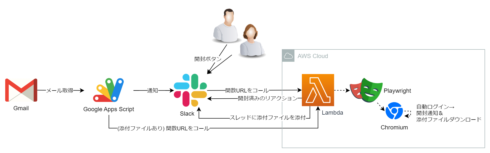

保育園メールリアクター
===

## 概要

保育園から届くメールの処理を半自動化・効率化するソリューションです。

- 開封済みリアクション
- 添付ファイル取得

## 構成

※本リポジトリーにGASのコードは含まれません。

## 環境構築

1. GitHub ActionsでAWSにデプロイ
    - GitHub Secrets
        - AWS IAM ユーザー情報
        - Slack Bot User OAuth Token
1. GASコードを作成してデプロイ
    - Lambda 関数URL (添付ファイル)
    - Slack 投稿チャンネル名
    - Slack Bot User OAuth Token
1. Slack Apps アプリを作成してインストール
    - OAuth & Permissions
        - Slack Bot User OAuth Token
            - `chat:write`
            - `files:write`
            - `incoming-webhook`
            - `reactions:write`
    - Interactivity & Shortcuts
        - Interactivity
            - Request URL
              - Lambda 関数URL (開封通知)

## 作者

[tissueMO](https://github.com/tissueMO)
